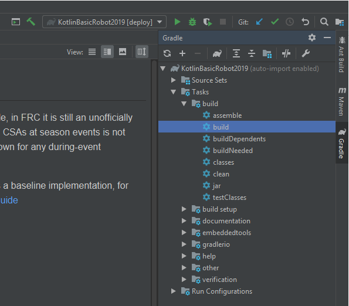

Kotlin Basic Robot 2019
---

**NOTE:** While Kotlin is a great language and will play just fine with Gradle, in FRC it is still an unofficially supported language, meaning support from the WPILib Team, and from CSAs at season events is not guaranteed. By using this language, you note that you may be on your own for any during-event troubleshooting.

This example involves building and deploying Kotlin sources. This gives a baseline implementation, for more details on building with Kotlin please see the [Kotlin Gradle User Guide](https://kotlinlang.org/docs/reference/using-gradle.html)

**We still recommend using Intellij for Kotlin development since at least at this point it appears to have the best Kotlin support.**

Intellij Build Project:

Intellij Deploy Project:

Example Usage:

Example ShuffleBoard:

